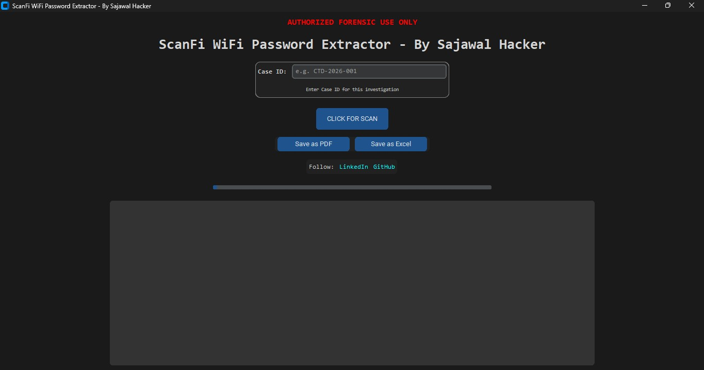
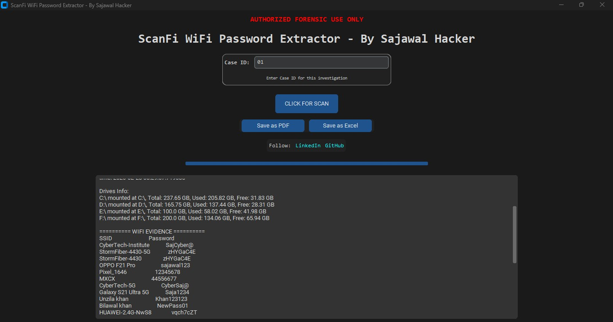

# ScanFI WiFi Password Extractor - by Sajawal Hacker

**ScanFI** is a professional and authorized WiFi forensic tool designed to **extract WiFi profiles, passwords, and system network information** for authorized investigations.

---

## Features

- Extracts all saved WiFi SSIDs and passwords.
- Collects system information: OS, RAM, MAC, IP, and connected drives.
- Generates **PDF and Excel forensic reports** with a single click.
- SHA256 hash generated for evidence integrity.
- Professional GUI built with **CustomTkinter**.
- Interactive progress bar and informative popup alerts.
- Easy to use for **network forensics and authorized investigations**.

---

## Screenshots

### Main GUI


### Result


---

## Installation

1. Clone the repository:

```bash
git clone https://github.com/your-github/ScanFI-WiFi-Extractor.git
```

2. Navigate to the project folder:
```
cd ScanFI-WiFi-Extractor
```

3. Install required modules:
```
pip install -r requirements.txt
```
---

## Usage

1.Run the Python script:
```
python ScanFI.py
```
2. Enter Case ID (optional) and click Click for Scan.

3. Save the report as PDF or Excel using the buttons.

4. Popup alerts confirm successful scans and saves.

---
License

This project is released under the MIT License.

---
LinkedIn: https://linkedin.com/in/sajawalhacker/
GitHub: https://github.com/Sajawal-hacker
YouTube: https://youtube.com/@Pakcyberdefence
